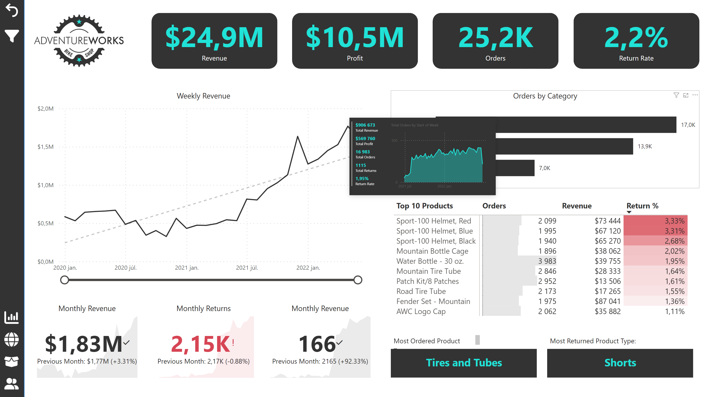
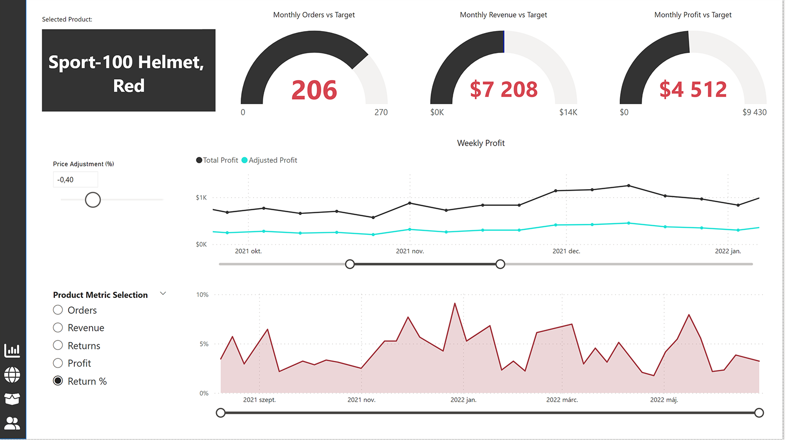
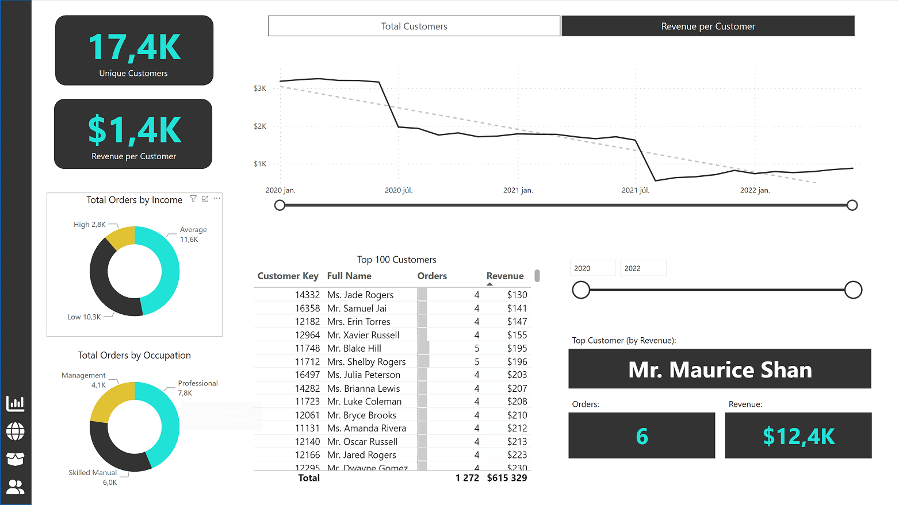
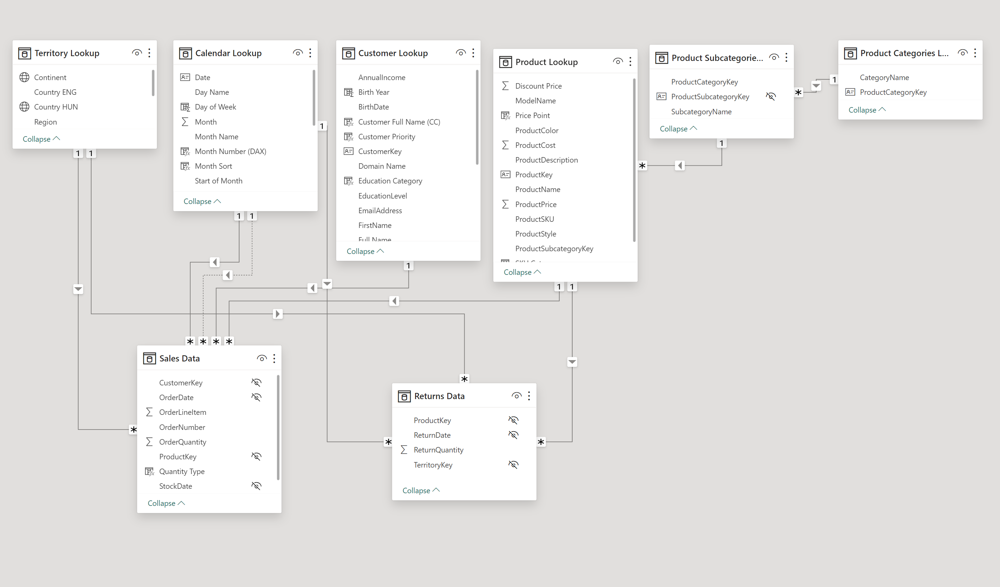

# Sales Analysis (Power BI)

End-to-end **sales analytics** dashboard built on the AdventureWorks dataset. It
demonstrates **Power Query data shaping**, **star-schema modeling**, and **DAX**
for time intelligence and comparative analysis. The report contains **three
tabs** to cover executive KPIs, product deep-dives, and customer insights.

---

## 🔍 Highlights

- **Star schema**: `Sales Data` (fact) linked to `Calendar`, `Customer`,
  `Product`, `Product Subcategories`, `Product Categories`, `Territory`
  (dimensions).
- **Time intelligence**: rolling windows and YoY trends using a marked Date
  table.
- **Interactive analysis**: drillthrough, slicers, KPI cards, and tooltip
  details.
- **Business questions**: revenue/profit trends, product performance vs targets,
  return rate, and high-value customers.

---

## 📊 Report Pages

### 1) Comprehensive Sales Performance Overview

- Executive KPIs: **Revenue**, **Profit**, **Orders**, **Return Rate**
- Weekly revenue trend (with projection), **Orders by Category**, **Top 10
  Products** heatmap
- Monthly revenue/returns highlights and most-ordered/most-returned items



---

### 2) In-Depth Analysis of Selected Item

- Pick a product to see **Orders vs Target**, **Revenue vs Target**, **Profit vs
  Target**
- **Weekly Profit** trend with **Adjusted Profit** scenario (price slider)
- Metric switcher for Orders / Revenue / Returns / Profit / Return %



---

### 3) Customer Revenue Insights

- **Unique Customers** and **Revenue per Customer** KPIs
- Top 100 customers table; distribution of orders by **Income** and
  **Occupation**
- "Top Customer" card with Orders & Revenue



---

## 🧱 Data Model & Transformations

Modeled as a **star schema** with a proper Date table (marked as Date) and
**single-direction** relationships from dimensions to the fact.



### Key tables

- **Fact**: `Sales Data`, `Returns Data`
- **Dimensions**: `Calendar Lookup`, `Customer Lookup`, `Product Lookup`,
  `Product Subcategories`, `Product Categories Lookup`, `Territory Lookup`

### Power Query (examples)

- Enforced data types; added year/month parts and month sort columns
- Cleaned/renamed columns and created surrogate/business keys
- Filtered null/invalid rows for reliable DAX measures

---

## 🧮 DAX Highlights (2 examples)

```DAX
-- 90-day Rolling Profit
90-day Rolling Profit :=
CALCULATE (
    [Total Profit],
    DATESINPERIOD (
        'Calendar Lookup'[Date],
        MAX ( 'Calendar Lookup'[Date] ),
        -90,
        DAY
    )
)
```

```DAX
-- Orders where the product price is above the overall average price
High Ticket Orders :=
CALCULATE (
    [Total Orders],
    FILTER (
        'Product Lookup',
        'Product Lookup'[ProductPrice] > [Overall Average Price]
    )
)
```

## 🗄️ SQL Connectivity with Parameters

The PBIX is wired with **Power Query parameters** to demonstrate how Power BI
can connect to a T-SQL view layer in SQL Server.

### Parameters defined in Power Query

- `Parameter_Server` (Text)
- `Parameter_Database` (Text)
- `RowLimit` (Whole Number)
- `StartDate` (Date)

### T-SQL statement (parameterized)

```m
let
    Server   = Parameter_Server,
    Database = Parameter_Database,
    Src      = Sql.Database(Server, Database),
    SqlText  = "
        SELECT TOP (@n) *
        FROM dbo.vw_SalesFact
        WHERE OrderDate >= @startdate
        ORDER BY OrderDate DESC;
    ",
    Result   = Value.NativeQuery(
                 Src,
                 SqlText,
                 [
                   n = RowLimit,
                   startdate = StartDate
                 ]
               )
in
    Result
```
